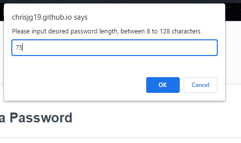
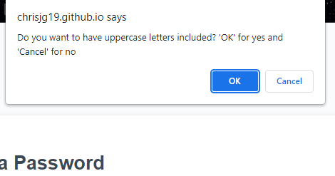
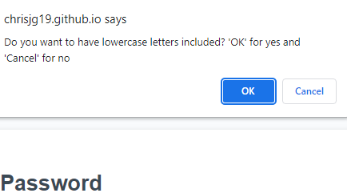
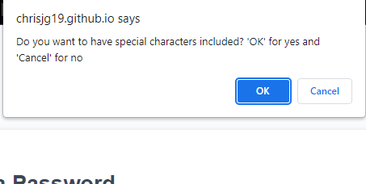
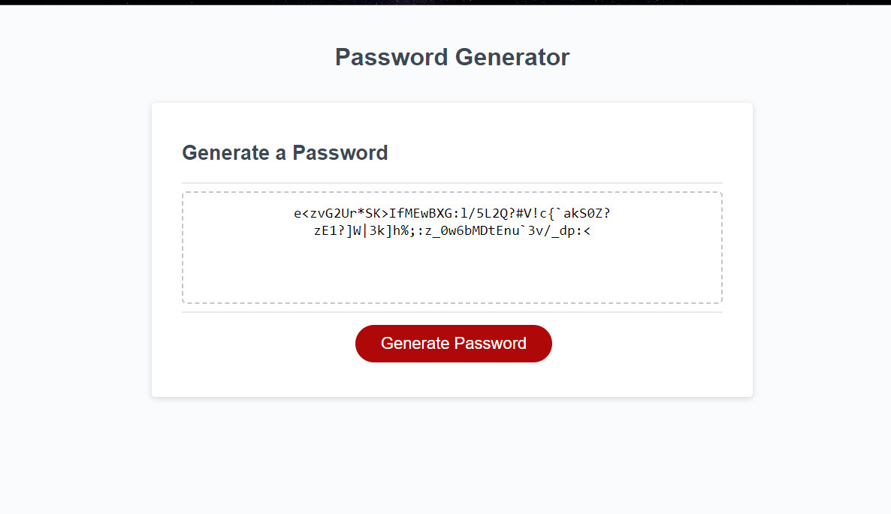

# JS-Password-Generator-Challenge

## The purpose of this Project was to work of the initial given code and create a working password generator. It had to meet the following criterias: 

```
GIVEN I need a new, secure password
WHEN I click the button to generate a password
THEN I am presented with a series of prompts for password criteria
WHEN prompted for password criteria
THEN I select which criteria to include in the password
WHEN prompted for the length of the password
THEN I choose a length of at least 8 characters and no more than 128 characters
WHEN asked for character types to include in the password
THEN I confirm whether or not to include lowercase, uppercase, numeric, and/or special characters
WHEN I answer each prompt
THEN my input should be validated and at least one character type should be selected
WHEN all prompts are answered
THEN a password is generated that matches the selected criteria
WHEN the password is generated
THEN the password is either displayed in an alert or written to the page
```

## User Story

I had to demonstrate my javascript knowledge I have learned so far in order to complete this project. Which was not easy, a lot of googling and reading from w3schools and other learning websites was needed. 

## Screenshot of Working product










## Link to deployed page 
https://chrisjg19.github.io/JS-Password-Generator-Challenge/

